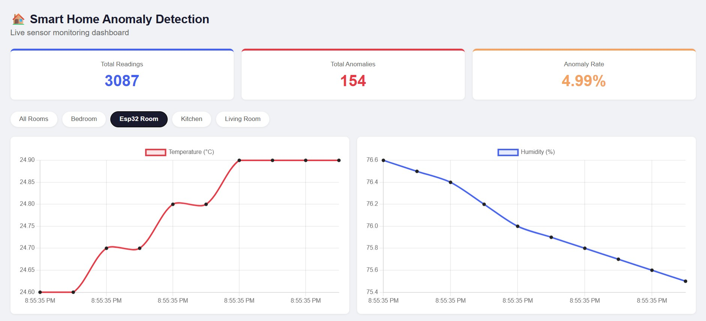
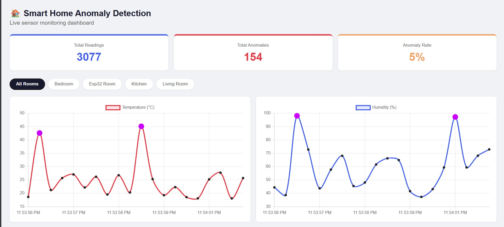
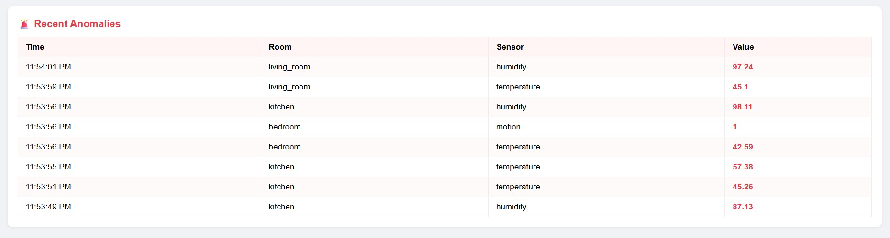
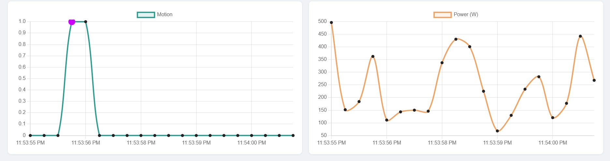

# 🏠 Smart Home Anomaly Detection System

A full-stack IoT pipeline that monitors real and simulated sensor data across multiple rooms, detects anomalies in real time using a trained Isolation Forest model, and visualises everything on a live React dashboard.

Built as a portfolio project across 3 weeks — covering data simulation, ML training, a REST + WebSocket backend, a React frontend, and real hardware integration with an ESP32 + DHT22 sensor.

---

## 📸 Screenshots

### Live Dashboard — All Rooms (anomalies highlighted in purple)


### Esp32 Room — Real Hardware Data (live temperature & humidity from DHT22)


### Motion & Power Charts with Anomaly Detection


### Recent Anomalies Feed


---

## 🏗️ Architecture

```
ESP32 + DHT22 (real sensor)  ─────┐
                                   ▼
sensor_simulator.py (3 rooms) ──► Mosquitto MQTT Broker (Docker)
                                   ▼
                           Python Backend (Flask)
                                   │
                    ┌──────────────┼──────────────┐
                    ▼              ▼               ▼
               SQLite DB    Isolation Forest   Flask-SocketIO
               (storage)    (anomaly scoring)  (WebSocket)
                                                   ▼
                                        React Dashboard (live)
```

---

## 🛠️ Tech Stack

| Layer | Technology |
|---|---|
| Hardware | ESP32 DevKit V1, DHT22 temperature/humidity sensor |
| Firmware | Arduino IDE, C++ (WiFi, PubSubClient, ArduinoJson, DHT) |
| Broker | Mosquitto MQTT via Docker |
| Simulator | Python, paho-mqtt |
| Database | SQLite |
| ML | scikit-learn Isolation Forest |
| Backend | Flask, Flask-SocketIO, Flask-CORS, paho-mqtt |
| Frontend | React, Chart.js |

---

## 📁 Project Structure

```
smart-home-anomaly-detection/
├── simulator/
│   ├── sensor_simulator.py     # Publishes fake sensor data over MQTT
│   ├── data_logger.py          # Subscribes to broker, saves to SQLite
│   └── sensor_data.db          # SQLite database (not committed to git)
├── broker/
│   ├── mosquitto.conf          # Mosquitto broker config
│   └── docker-compose.yml      # Runs broker in Docker
├── ml/
│   ├── eda_and_features.ipynb  # EDA, feature engineering, model training
│   ├── features.csv            # Engineered feature dataset
│   └── anomaly_model.pkl       # Trained Isolation Forest model
├── backend/
│   └── app.py                  # Flask API + MQTT subscriber + WebSocket bridge
├── frontend/
│   └── dashboard/src/
│       ├── App.js              # Main React app with room filtering
│       └── SensorChart.js      # Live scrolling chart component
└── hardware/
    └── esp32_sensor/
        └── esp32_sensor.ino    # Arduino sketch for ESP32 + DHT22
```

---

## 🤖 ML Model

- **Algorithm:** Isolation Forest (unsupervised anomaly detection)
- **Training data:** 15,000+ labelled sensor readings across 3 rooms and 4 sensor types
- **Features:** `temperature`, `humidity`, `motion`, `power`, `hour`, `temp_diff`, `power_diff`, `temp_deviation`
- **Contamination:** 0.15
- **Performance:** Recall = 0.61, F1 = 0.61
- **Anomaly rate in production:** ~5% (matches simulator injection rate)

---

## 🚀 How to Run

### Prerequisites
- Python 3.8+
- Node.js 16+
- Docker Desktop
- Arduino IDE 2.x (for ESP32 hardware only)

### 1. Start the MQTT Broker
```bash
cd broker
docker-compose up -d
```

### 2. Start the Data Logger
```bash
cd simulator
python data_logger.py
```

### 3. Start the Flask Backend
```bash
cd backend
python app.py
```

### 4. Start the React Dashboard
```bash
cd frontend/dashboard
npm install
npm start
```

### 5. Start the Sensor Simulator
```bash
cd simulator
python sensor_simulator.py --anomaly
```

Dashboard will be live at `http://localhost:3000`

---

## 🔌 ESP32 Hardware Setup (Optional)

### Hardware Required
- ESP32 DevKit V1 (30-pin)
- DHT22 temperature & humidity sensor module
- 3 female-to-female jumper wires

### Wiring

| DHT22 Pin | ESP32 Pin |
|---|---|
| `+` (VCC) | `3V3` |
| `OUT` (Data) | `D4` (GPIO 4) |
| `-` (GND) | `GND` |

### Firmware Setup
1. Open `hardware/esp32_sensor/esp32_sensor.ino` in Arduino IDE
2. Install required libraries via Library Manager:
   - DHT sensor library (Adafruit)
   - Adafruit Unified Sensor
   - PubSubClient (Nick O'Leary)
   - ArduinoJson (Benoit Blanchon)
3. Add ESP32 board support via Boards Manager (Espressif Systems)
4. Update credentials in the sketch:
```cpp
const char* WIFI_SSID     = "YOUR_WIFI_SSID";
const char* WIFI_PASSWORD = "YOUR_WIFI_PASSWORD";
const char* MQTT_BROKER   = "YOUR_LAPTOP_LOCAL_IP";
```
5. Select **ESP32 Dev Module** under Tools → Board
6. Upload the sketch

Once flashed, the ESP32 publishes real temperature and humidity readings every 5 seconds to `home/esp32_room/sensors`. It appears automatically as a new room on the dashboard.

---

## 📡 API Endpoints

| Endpoint | Description |
|---|---|
| `GET /api/readings` | Recent sensor readings (supports `?limit=N`) |
| `GET /api/anomalies` | Recent anomaly events |
| `GET /api/stats` | Total readings, anomaly count, anomaly rate |
| `GET /api/rooms` | Distinct room names (used for dynamic filter buttons) |

WebSocket event: `sensor_reading` — emitted on every new reading for live dashboard updates.

---

## 💡 Key Design Decisions

**Why MQTT over HTTP?** MQTT is a publish-subscribe protocol designed for constrained IoT devices. It uses significantly less overhead than HTTP, the broker handles routing so devices don't need to know each other's addresses, and it supports QoS levels for guaranteed delivery on unreliable networks.

**Why Isolation Forest?** It's an unsupervised algorithm — it doesn't need labelled anomaly examples to train, it learns the shape of normal data and flags outliers. Well-suited for sensor data where you don't have many real anomaly examples.

**Why a hybrid real + simulated setup?** The ESP32 only provides temperature and humidity. Motion and power sensors require additional hardware. The simulator fills that gap, which is realistic for IoT pilot deployments where not all sensors are deployed on day one.

**Missing features for ESP32 room:** Motion and power values are imputed as 0 for the ESP32 room since that hardware isn't available. The model scores gracefully on whatever features it receives.
